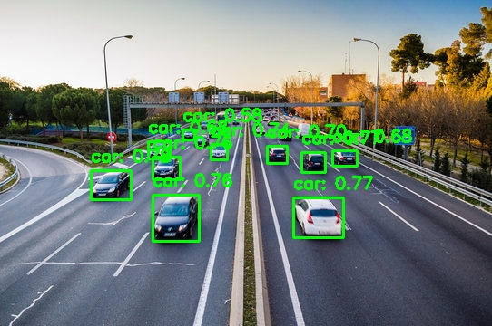

# Vision-Based Object Detection & Localization System

A computer vision pipeline for real-time object detection and localization, simulating industrial inspection workflows using YOLOv8 and OpenCV.


## 📋 Overview

This project demonstrates an end-to-end object detection system capable of:
- Detecting and localizing multiple objects in static images
- Running real-time detection via webcam feed
- Outputting annotated images with bounding boxes and confidence scores
- Printing structured detection summaries to the console

Designed to simulate industrial use cases such as manufacturing inspection, warehouse automation, and traffic monitoring.

## 🖼️ Sample Output



## 🛠️ Tech Stack

- **Python** — Core language
- **YOLOv8 (Ultralytics)** — Object detection model
- **OpenCV** — Image processing and visualization

## 📁 Project Structure

```
vision-detection-localization/
│
├── main.py               # Entry point — run detection on image or webcam
├── detector.py           # ObjectDetector class wrapping YOLOv8
├── utils.py              # Helper functions for image I/O and drawing
├── requirements.txt      # Project dependencies
├── sample_images/        # Test images
└── results/              # Output images with detections
```
## 🚀 Getting Started

### 1. Clone the repository
```bash
git clone https://github.com/aknashwin/vision-detection-localization.git
cd vision-detection-localization
```

### 2. Create and activate virtual environment
```bash
python -m venv venv
venv\Scripts\activate  # Windows
source venv/bin/activate  # Mac/Linux
```

### 3. Install dependencies
```bash
pip install -r requirements.txt
```

### 4. Run detection on an image
```bash
python main.py --mode image --input sample_images/test.jpg
```

### 5. Run real-time webcam detection
```bash
python main.py --mode webcam
```

## ⚙️ Arguments

| Argument | Default | Description |
|---|---|---|
| `--mode` | `image` | `image` or `webcam` |
| `--input` | `sample_images/test.jpg` | Path to input image |
| `--output` | `results/output.jpg` | Path to save output |
| `--confidence` | `0.5` | Detection confidence threshold (0-1) |

## 📊 Example Output

```
Detections found: 10
  - car | Confidence: 0.78 | BBox: [100, 188, 144, 220]
  - car | Confidence: 0.77 | BBox: [332, 168, 358, 190]
  - car | Confidence: 0.77 | BBox: [323, 218, 378, 262]
```

## 🔮 Future Improvements

- Add support for video file input
- Implement object tracking across frames
- Extend to custom-trained models for specific industrial components
- Add a Streamlit web interface for easy demo deployment
